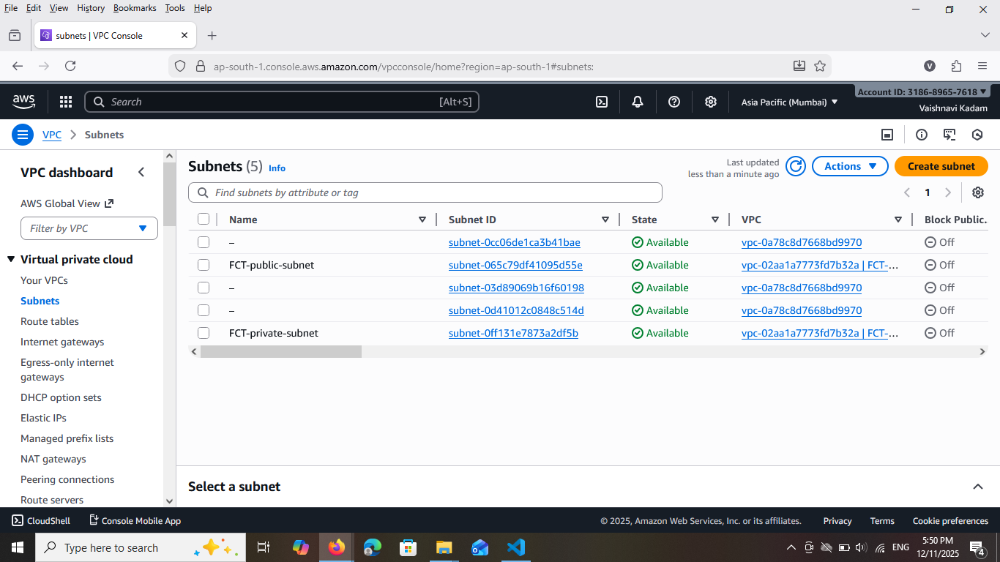
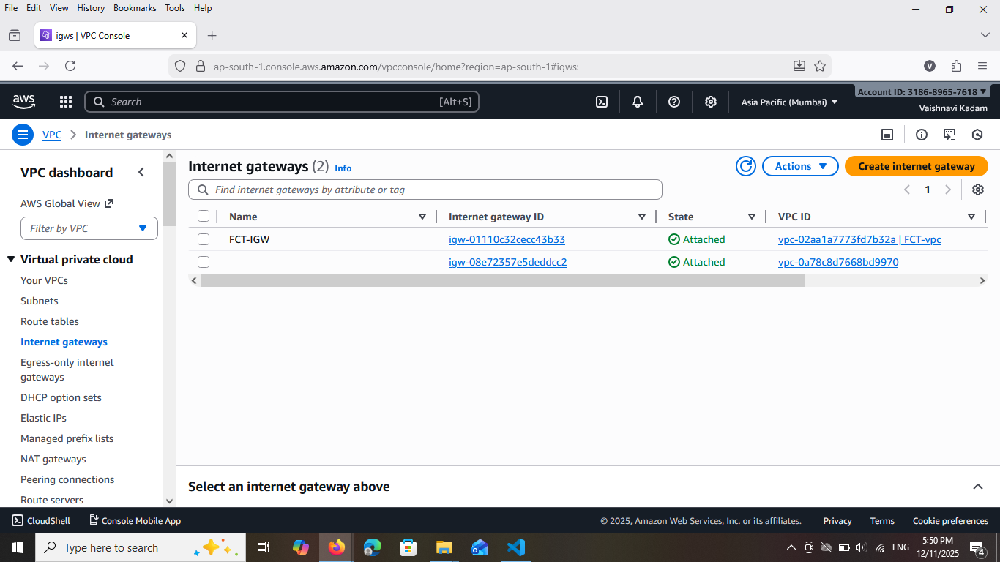

# Terraform 2-Tier AWS Architecture Deployment

This project deploys a complete **2-tier architecture on AWS** using **Terraform**, including:

- **VPC**
- **Public Subnet (App Tier)**
- **Private Subnet (DB Tier)**
- **Internet Gateway**
- **Route Tables**
- **Security Group**
- **EC2 Instance in Public Subnet (App Server)**
- **EC2 Instance in Private Subnet (DB Server)**
- **S3 Backend for Terraform Remote State**

This setup follows standard **2-tier architecture**:  
**Tier 1 → Application (Public EC2)**  
**Tier 2 → Database (Private EC2)**

---

# ## 📘 Architecture Overview
---


S3 Bucket (Terraform State)
            ↑
AWS Cloud → VPC → Public Subnet → App EC2 → Internet Gateway → Internet
                      ↓
                 Private Subnet → DB EC2


---

# ## 📂 Project Structure

├── main.tf
├── variables.tf
├── output.tf
├── README.md
└── screenshots/


---

# ## ⚙️ Features

### ✔ Automated AWS Infrastructure  
All resources are deployed through Terraform.

### ✔ 2-Tier Architecture  
App server (public) + DB server (private).

### ✔ VPC Networking  
Custom CIDR, subnets, routing, IGW.

### ✔ Security Group  
SSH (22), HTTP (80), HTTPS (443).

### ✔ Remote Backend  
Terraform state stored in S3.

---

# ## 🛠 Prerequisites

Install the following:

- Terraform (v1.0 or later)
- AWS CLI
- An existing AWS key pair
- IAM user with programmatic access
---

## Configure AWS credentials:
```
aws configure

##  ▶️ How to Deploy

1️⃣ Initialize Terraform

terraform init

2️⃣ Validate

      terraform validate

3️⃣ View the Plan

      terraform plan

4️⃣ Apply Configuration

      terraform apply --auto-approve
```
## 📤 Outputs

Terraform prints:
```
public_ip  = x.x.x.x
private_ip = 10.x.x.x
```
## 📸 Screenshots (Add Your Files)

✔ Terraform Apply Success


✔ EC2 Instances Created


✔ VPC & Subnets




✔ Internet Gateway



✔ Route Table


✔ S3 Backend Bucket


## 🧹 Destroy Infrastructure

To delete all resources:

terraform destroy --auto-approve

## 📦 Technologies Used

Terraform

AWS VPC

AWS EC2

AWS S3

Networking (IGW, Routes, Subnets)

## 👨‍💻 Author

**Vaishnavi Kadam**

Cloud & DevOps Learner
